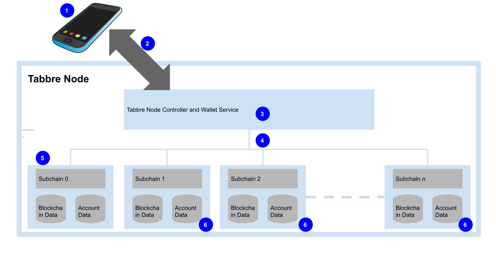

# Introduction

The purpose of this document is to describe in general terms how the Tabbre Multichain Ledger works and how it solves the problem of very low transaction rates that is holding back  blockchain development. 

This document assumes that the reader is familiar with terminology and  basic concepts of blockchain technology such as smart contracts and consensus protocols.

Tabbre intends to become the world’s independent decentralized monetary system that will supplement and compete with  the world’s existing fiat based banking systems. 

For Tabbre to deliver a truly global financial system that can replace fiat currencies, including cash and existing banks, requires a fully scalable architecture. 

# Tabbre’s approach to Scalability

The lack of scalability is a major concern for blockchain developers. Various approaches have been tried, all come up short.  The problem of blockchain scalability in terms of transactional throughput is typically presented as a trilemma, where only two out of the following three alternatives can be had: 

- High transaction throughput

- Security

- Decentralization

All current efforts to provide a high transactional throughput seem to sacrifice either security or more typically decentralization.  Some achieve modest improvements in transactional throughput  over the established decentralized blockchains by optimizing existing design practice without sacrificing either security or decentralization. The Tabbre project takes advantage of this work.

The root cause of the trilemma is the fact that the consensus process for replicated state machines at the heart of the blockchain decentralized ledger is fundamentally single threaded.

The trilemma can never be solved for a single blockchain. The best that can be achieved is an optimised design that will allow something like a thousand transactions per second. This is two or three orders of magnitude better than the early blockchain designs, but is still orders of magnitude too small for a globalised system that will require millions of transactions per second.

Tabbre proposes to solve the problem of scalability by the simple expedient of introducing many blockchain ledgers, each of identical design and operation, each operating their own independent consensus and each expressing the same currency. Tabbre calls this architecture a Multichain Ledger. 

Transfers of value between blockchains will not be needed. 

An amount  of coin on one Tabbre blockchain is worth the same as the same amount of coin on any other Tabbre blockchain. 

Transfers to accounts will create the account if it doesn’t already exist. A user’s account balances can exist on any number of Tabbre blockchains. 

End users will not see the individual blockchains,  their experience will be simplified by wallets that provide an aggregate view of an account, all balances for an account that exist on every blockchain in the ledger will be displayed as a single account balance by the wallet.

The Tabbre approach is conceptually simple and delivers increased throughput.

tx.s-1 	= Number of Transactions per second

tx.b-1  	= Number of Transactions  per block

b.s-1	= Block Rate Per Second

N	= Number of blockchains in multichain

For all existing blockchains:

Transaction rate per second  = 	(Number of Transactions  per block) x 

(Block Rate Per Second) 

or :  tx.s-1 	 = tx.b-1 x b.s-1	

For Tabbre: 

Transaction rate per second  = 	(Number of Transactions  per block) x 

(Block Rate Per Second) x 
    (Number of blockchains)

or: tx.s -1 	 = tx.b-1 x b.s-1 x N

This approach means that the Tabbre architecture is linearly scalable: each blockchain requires the same processing power as any other blockchain in the multichain ledger and the more blockchains that exist the more transactional throughput is  available.

Adding more blockchains and proportionately more processing power adds more throughput.

# How the Tabbre multichain ledger works

The Tabbre protocol provides a mechanism for sharding a blockchain based distributed ledger and in so doing addresses the problem of scalability that afflicts other blockchain systems. The Tabbre scheme provides for near linear scalability, the more shards that are added together with proportionately more processing power, the correspondingly more transaction throughput.

In the Tabbre system the shards are referred to as subchains and the complete Tabbre ledger that consists of the subchains is termed a multichain. 

Each subchain is a self contained blockchain based replicated database with its own replication consensus and works independently of any other subchain. All subchains are equally secure. It  is envisaged that the multichain will be constructed by repurposing an existing blockchain protocol such as Ethereum or Thunder Core.

**Figure 2 Multichain**

*Description of Fig 1*

1. *Wallet* 

2. *Interaction from wallet to Tabbre node*

3. *Tabbre node:*

   *a) Node Controller*

   *b) Wallet Services*

   *c) Nodes on subchains*

4. *Interaction of Tabbre subchains with other subchains hosted on other Tabbre nodes*

5. *Subchains*

Because funds held on the subchains are all denominated in units of the same currency, an amount n of Tabb held on one subchain is worth the same as  n Tabb held on any other subchain. There is no need to transfer funds between subchains. An account on the Tabbre system may have values held on one or more of the subchains that make up the Tabbre ledger.

A Tabbre account address is the same on all subchains. The value of funds held in an account is the sum of all the balances for that account that are held on all the subchains of the Tabbre multichain. 

The Tabbre multichain will consist of many subchains so that an account that holds funds may have values on one or more of the subchains:

For example if account **A** has balances on chains 0, 1, 2 , 5 , 9

The account balances for  **A**  on the various subchains are: 

​	subchain 0 = a0

​	subchain 1 = a1

​	subchain 2 = a2

​	subchain 5 = a5

​	subchain 9 = a9

So that account A’s total balance = a0 + a1 + a2 + a5 + a9

The wallet program will provide account holders with an aggregate view of their account balance.

An example transaction: Alice sends Bob 500 Tabb. 

Alice has accounts on 5 subchains: 

​	subchain 0 = 100

​	subchain 1 = 100

​	subchain 2 = 100

​	subchain 5 = 200 

​	subchain 9 = 300

​	**Total balance = 800 Tabb**

Bob has accounts on 3 subchains:

​	subchain 1 = 100

​	subchain 9 = 100

​	subchain 20 = 100

​	**Total balance = 300 Tabb**

Alice sends Bob 500 Tabb

​	tx.send(from: AliceAccount, to:BobAccount, Amount:500): 

Alice doesn’t have 500 Tabb in any single account so Alice's wallet program would split this into 2 transactions:

​	tx.subchain(5).send(from: AliceAccount, to:BobAccount, Amount:200)

​	tx.subchain(9).send(from: AliceAccount, to:BobAccount, Amount:300)

After processing, the account balances would be:

Alice  accounts : 

​	subchain 0 = 100

​	subchain 1 = 100

​	subchain 2 = 100

​	subchain 5 = 0 

​	subchain 9 = 0

​	**Total balance = 300 Tabb**

Bob  accounts:

​	subchain 1 	= 100

​	subchain 5 	= 200 

​	subchain 9 	= 400

​	subchain 20 = 100

​	**Total balance = 800 Tabb**

Bob will have acquired an extra account on subchain 5 to hold the value transferred from Alice.

The wallet program will have to be able to discover the location of an accounts balances on all the multichain’s subchains.

# The Design of a Multichain Ledger

The Tabbre ledger will be evolved through three stages:

- Single chain Proof of Authority ledger
- Multichain Proof of Authority Ledger
- Multichain Proof of Stake Ledger

The native currency expressed on the blockchain will be the Tabb.

A transaction gas charge will be payable in Tabb.

Consensus nodes will be associated with a Tabbre account on a one to one basis. These accounts are validator accounts.

Only validator accounts will be permitted to upload smart contracts to be executed on either the core chain or the subchains.

## Single chain Proof of Authority ledger

The Tabbre Core Chain, will be implemented as a Proof of Authority blockchain using Ethereum derived software. This will use a Proof of Authority consensus protocol such as Ethereum Clique. Consensus nodes will be hosted by the Tabbre Project. 

Other parties will be able to join the Tabbre network by downloading the blockchain data from one of the Tabbre Project nodes and will be able to submit transactions to the network.

The Tabbre Core Chain will have an initial supply of Tabb, this will be allocated to the accounts under the control of the Tabbre Project.

As the Tabbre protocol is developed there will be a number of hard forks as new versions of the Tabbre protocol are implemented.

## Multichain Proof of Authority Ledger

The Tabbre Project intends to launch a global airdrop of Tabb to potentially billions of people. To support such an airdrop the Tabbre network must be able to handle billions of accounts and the transaction volume that this implies, in the order of 105  transactions per second. 

A single Ethereum PoA network using the HotStuff consensus protocol such as ThunderCore can be tuned to process several hundred  transactions per second. 

To accommodate the number of accounts and the potential transactional volume Tabbre proposes to scale out to 1000 subchains in this phase each using a PoA consensus.

As part of the migration to a multichain and a fully adopted global system. It is envisaged that other trusted organizations and groups will run Tabbre validator nodes to increase the level of distribution of risk and  start the process of decentralization.

The creation of smart contracts on  the Tabbre Multichain will still be restricted to validator accounts.

## Multichain Proof of Stake Ledger

Once the Tabbre protocol is accepted and the Tabbre system is adopted on a global scale Tabbre proposes to move to a fully decentralized system using  a proof of stake consensus model based on the Ouroboros protocol. The detail of this is covered in the Tabbre PoS White Paper.

## Nodes

The Tabbre system will be run on nodes. A node is an internet connected computer with adequate storage, network bandwidth and processing power for running the Tabbre Node. 

Nodes are likely to be substantial systems, especially if they run a significant number of Tabbre subchains.

The Core Chain shall exist on all nodes that run the Tabbre Node Controller component.

The Core Chain retains the records of the transactions that have been used to create the other Tabbre blockchains. The Core Blockchain is used by nodes to establish the veracity of other Tabbre blockchains.

A node will maintain a transactional database holding account state and balances for all accounts on the blockchains that the node is hosting. Each Node holds a list addresses of other nodes in the Tabbre network with which it corresponds as part of the peer to peer network.

**Figure 2 Tabbre Node**

Client programs, such as a wallet (1) interact with the Tabbre Network by sending and receiving messages (2) to a Tabbre Node Controller (3). These messages are either transaction or information requests. 

Information requests include account balance requests. The node will forward received requests (4) to an appropriate sub node (5,6) for processing. If a request is to be routed to a subchain that the node doesn’t host, itself it will forward the request to an appropriate node.

Some subnodes that run Tabbre subchains may accept transaction requests from client programs directly.

It is however envisaged that the Tabbre network will utilise a Blockchain Distribution Network so direct access will be unlikely to be possible.

## Consensus

### Permissioned Tabbre 

The Tabbre system will initially be a permissioned blockchain, this will require an enumerated list of validator nodes. The consensus algorithm is expected to use either Ethereum Clique or ThunderCore’s HotStuff consensus. 

The reason for using a permissioned blockchain in the early stages is that it makes control and release of protocol changes much easier. Once the Tabbre network become permissionless, protocol changes become much harder to implement.

### Permissionless Tabbre 

When conditions are right, the Tabbre Project expects to migrate to an Ouroboros based public consensus algorithm for all the subchains in the multichain.

# Tabbre Wallets

The Tabbre Wallet is central to the usability of the Tabbre multichain. It will hide the complexity of the Tabbre Multichain from  account holders and will provide them with a simplified view of their account.

# The Tabbre Wallet Service

The Wallet Service will be hosted by the Tabbre Node and will provide the following services to wallet clients:

1. Subchain Discovery
2. Subchain Account Balances
3. Transaction Routing

## Subchain Discovery

A wallet client will send a chain discovery request to the Tabbre node. The Tabbre node will respond with a list of all the subchains that it is aware of and network addresses for nodes on each subshchain.

## Subchain Account Balances

A wallet client will send an Account Balance request to the Tabbre node. The Tabbre node will respond with a list of all the accounts balances on all the subchains that it is aware of. The list will include the Chain ID, chains blockheight and the Tabb balance.

## Transactions Routing

A wallet client will send a signed transaction request containing the Chain Id of the subchain that the transaction is to be submitted to. If the node has a network address for the appropriate subchain node, it will submit the transaction to that node otherwise it will attempt to discover the network address of a node that hosts the subchain so that it can submit the transaction to that node, otherwise it will reject the transaction.

# Smart Contracts

Tabbre requires the ability to process smart contracts on the core chain and the sub chains to support the operation of  the Tabbre protocol. A generalised smart contract execution environment is proposed and is not described in this white paper.

# The Creation of the Multichain

Tabbre will have two methods for creating new blockchains, the first proposed method is to fork the Master Chain into a number of auxiliary chains  and the second method is to split an auxiliary chain into two new chains. The reasons for these two methods are explained in the The Tabbre Road Map section.

## Forking the Core Chain

To create a large supply of Tabb it is proposed to create the first Tabbre Multichain Ledger by forking from a single main blockchain: the Core Chain. The process will be managed by smart contracts running on the core chain. These subchains will be created using the process described here:

- A New Blockchain Creation (NBC) request  transaction will be submitted to the Core Chain. 
- This transaction will only be accepted if a majority of Core Chain validator accounts approve it. The NBC request will include information for  the new chain’s Genesis block.
- Once approved, the nodes will create a new blockchain instance using the information for the Genesis block provided in the NBC request and will start to copy account balances for all the existing accounts on the Core Chain as they existed at the Core Chain’s block height  that includes the NBC request transaction.
- Once the nodes have created the copy blockchain and associated account database, the node will create  a Blockchain Instantiation transaction on the Core Chain. This transaction contains the new subchain’s identifier and the Hash of the last block written to the new  subchain during its creation process. 
- Once a majority Core Chain validator accounts approve the transaction, the new subchain is now ready for business.  The nodes will now be processing transactions for both the newly created blockchain and also any existing blockchains that they already host. 
- Forking the Core Chain ensures that existing Master Blockchain Tabb holders will not see their holdings of Tabb  diluted relative to the total number of issued Tabb.

The process of forking the Core Chain is governed by the validator community of  the Core Chain. The consensus mechanism for accepting or rejecting a chain fork will be implemented as a smart contract system running on the Core Chain. The details of this mechanism are still being developed.

## Chain Splitting

As the Tabbre system grows and transactional volumes increase, it may be the case that some individual blockchains become bottlenecks. In this case the Tabbre system has the ability to split an individual blockchain into two new blockchains with account balances  being allocated to one or other of the new blockchains. 

The detailed implementation of this splitting process will require that transactions that are submitted to the blockchain that is being split will be either held back in a pending state while the new blockchains are created or rejected. In the initial implementation, for the sake of simplicity, incoming transactions that arrive during a chain split will be rejected.

The process of splitting a blockchain into two is governed by the validator community of  the Tabbre Core blockchain. 

A request to split a subchain is sent as a transaction to the Tabbre Core Chain. The consensus mechanism for accepting or rejecting a chain split will be implemented as a smart contract system running on the Tabbre Core Chain. The details of this mechanism is still being developed.

# Transaction Charges

The Tabbre multi-chain scheme helps with transaction throughput provided the following are true:

1. For any account, the average send transaction amount is less than or equal to the aggregate account balance for that account held on a subset of the total number of subchains in the multi-chain
2. Accounts on average use the minimum number of transactions to send any given amount to another account

These conditions matter because if all accounts generate send requests that always result in transactions on all the subchains than the transactional throughput of the multichain will be no greater than for a single threaded blockchain ledger.

To help ensure that this is never the case, the Tabbre system will charge for transactions. It is envisaged that transaction charges will be varied according to congestion with validators preferring   to process transactions with a higher gas price. This will result in wallet services being tuned to minimise transaction charges by choosing the most economic way of delivering a request to send funds to another account.

